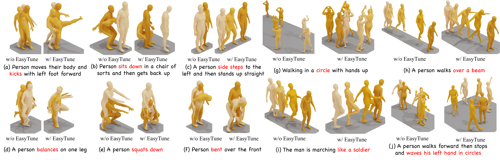
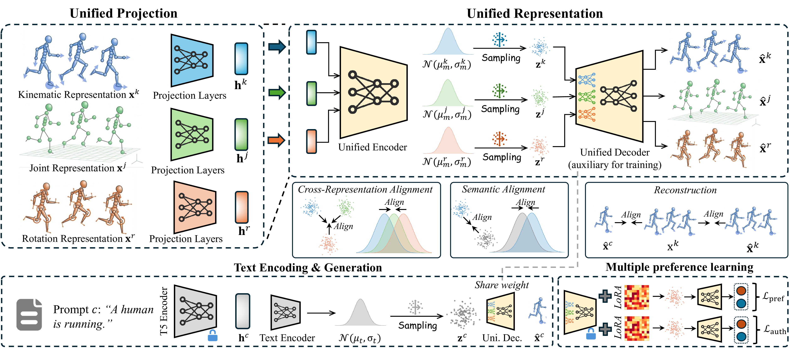
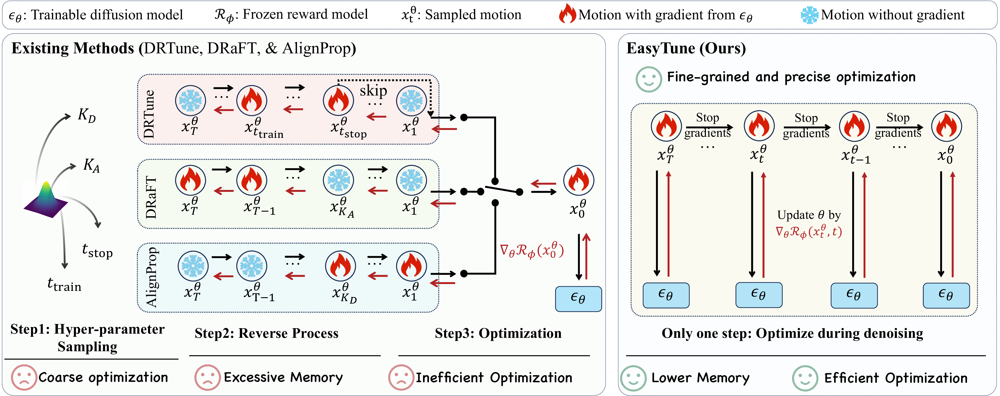
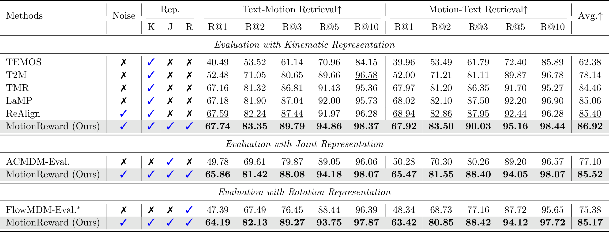
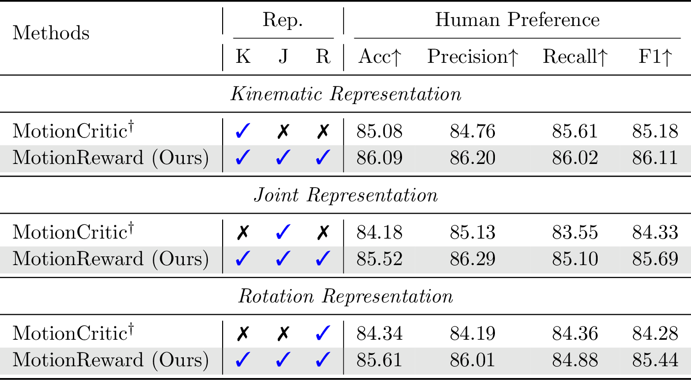
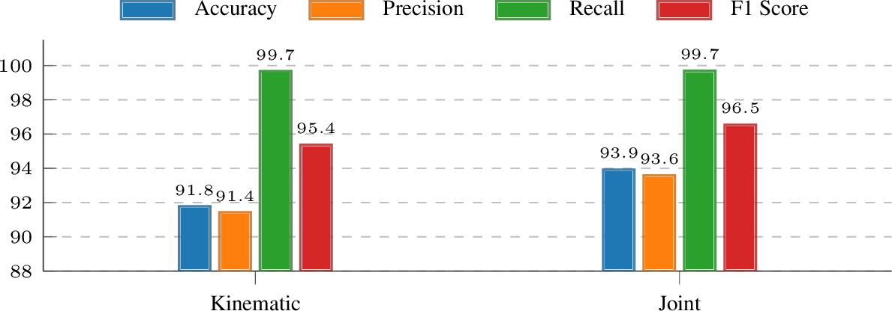
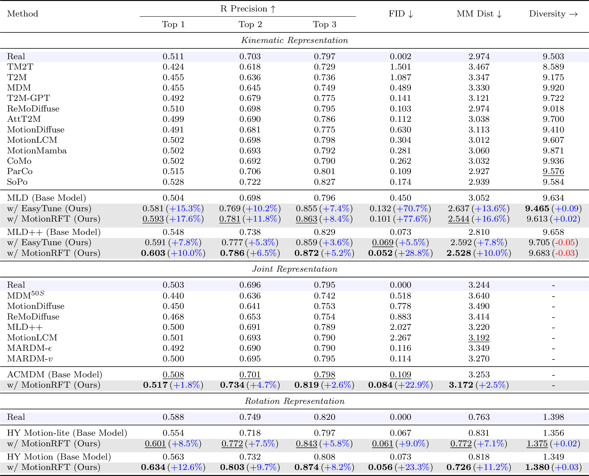

<h1 align="center"><strong>MotionRFT: Unified Reinforcement Fine-Tuning for Text-to-Motion Generation</strong></h1>

<p align="center">
  <strong>UNDER REVIEW</strong>&emsp;|&emsp;Extended from <a href="">EasyTune</a> (ICLR 2026)
</p>


<p align="center">
  <a href='https://xiaofeng-tan.github.io/' target='_blank'>Xiaofeng&nbsp;Tan</a>&emsp;
  Wanjiang&nbsp;Weng&emsp;
  Hongsong&nbsp;Wang&emsp;
  Fang&nbsp;Zhao&emsp;
  Xin&nbsp;Geng&emsp;
  Liang&nbsp;Wang
  <br>
  Southeast University&emsp;
  Nanjing University&emsp;
  Chinese Academy of Sciences
</p>

<p align="center">
  <a href="https://xiaofeng-tan.github.io/projects/MotionRFT/">
    
  </a>
  <a href="">
    
  </a>
  <a href="https://huggingface.co/datasets/txf0620/MotionRewardData">
    
  </a>
  <a href="https://modelscope.cn/datasets/XiaofengTan/MotionRewardData">
    
  </a>
  <a href="https://huggingface.co/txf0620/MotionRFT_Models">
    
  </a>
  <a href="https://modelscope.cn/models/XiaofengTan/MotionRFT_Models">
    
  </a>
  <a href="https://huggingface.co/txf0620/MotionRFT_Checkpoints">
    
  </a>
  <a href="https://modelscope.cn/models/XiaofengTan/MotionRFT_Checkpoints">
    
  </a>
</p>

<p align="center">
  
</p>
<p align="center"><em>Visual results on HumanML3D. "w/o" = original base model; "w/" = after fine-tuning with EasyTune.</em></p>

This repository offers the official code for **MotionRFT**. If you have any questions, feel free to contact **Xiaofeng Tan** ([xiaofengtan@seu.edu.cn](mailto:xiaofengtan@seu.edu.cn)).

> If you encounter any issues with the code, please don't hesitate to let us know — we are committed to building and **continuously maintaining** a robust codebase for reinforcement fine-tuning in motion generation.

---

## 📑 Table of Contents

- [🔥 News](#-news)
- [📋 Plan](#-plan)
- [💡 Introduction](#-introduction)
- [📊 Experimental Results](#-experimental-results)
- [📁 Project Structure](#-project-structure)
- [⚙️ Setup](#️-setup)
- [📦 1. Data Preparation](#-1-data-preparation)
- [🎯 2. MotionReward Training](#-2-motionreward-training)
- [🚀 3. Reinforcement Fine-Tuning (RFT)](#-3-reinforcement-fine-tuning-rft)
- [🎬 4. Visualization & Rendering](#-4-visualization--rendering)
- [🙏 Acknowledgement](#-acknowledgement)
- [📝 Citation](#-citation)

---

## 🔥 News
- **[2026/02]** Release code, data, and pretrained models.

## 📋 Plan
- [x] Release training data and pretrained dependencies.
- [x] Release MotionReward training and evaluation code.
- [x] Release RFT code for MLD (263-dim).
- [x] Release RFT code for HY-Motion (135-dim).
- [x] Release pretrained checkpoints.
- [ ] Organize and polish documentation for each codebase module.
- [ ] Release paper.

---

## 💡 Introduction

**MotionRFT** is a reinforcement fine-tuning framework for text-to-motion generation, comprising a unified multi-representation reward model **MotionReward** and a step-wise, memory-efficient fine-tuning strategy **EasyTune**. It allows developers to fine-tune any diffusion- or flow-based motion generation model using multi-dimensional reward signals, achieving significant improvements in semantic alignment, human preference, and motion quality.

### Key Features

- **Unified Multi-Representation Reward**: A single reward model serving three motion representations (263-dim, 22x3, 135-dim) via a shared semantic embedding space.
- **Multi-Dimensional Reward**: Jointly optimizes retrieval, preference, M2M similarity, and AI detection rewards, preventing single-objective over-optimization.
- **Three-Stage Training**: Stage 1 (Retrieval) → Stage 2 (Critic LoRA) → Stage 3 (AI Detection LoRA), each building on the previous.
- **Step-Wise Fine-Tuning (EasyTune)**: O(1) memory instead of O(T) by decoupling denoising-step dependence, enabling dense and fine-grained optimization.
- **Cross-Model Generalization**: Validated on 6 models × 3 representations, achieving FID **0.132** with **22.10 GB** peak memory.

### Framework

<p align="center">
  
</p>
<p align="center"><em>MotionReward: Maps heterogeneous motion representations into a shared semantic embedding space, where text serves as an anchor for multi-dimensional reward learning.</em></p>

<p align="center">
  
</p>
<p align="center"><em>EasyTune: Fine-tunes step-wise rather than over the full denoising trajectory, decoupling recursive dependence for memory-efficient and fine-grained optimization.</em></p>

---

## 📊 Experimental Results

### MotionReward Evaluation

<p align="center">
  
</p>
<p align="center"><em>Text-motion retrieval evaluation across kinematic (263), joint (22x3), and rotation (135) representations.</em></p>

<p align="center">
  
  &emsp;
  
</p>
<p align="center"><em>Left: Human preference prediction. Right: Motion authenticity detection.</em></p>

### SoTA Comparison on HumanML3D

<p align="center">
  
</p>
<p align="center"><em>Text-to-motion generation on HumanML3D across three representations. MotionRFT achieves best FID of 0.052 (MLD++) and 0.056 (HY-Motion).</em></p>

---

## 📁 Project Structure

```text
MotionRFT/
├── motionreward/                      # MotionReward core package
│   ├── models/                        # Model definitions
│   ├── training/                      # Training logic
│   │   └── train_retrieval_lora_new.py
│   ├── datasets/                      # Data loading
│   ├── evaluation/                    # Evaluation metrics
│   └── utils/                         # Utilities
├── RFT_MLD/                           # RFT for MLD (263-dim)
│   ├── mld/                           # MLD model code
│   ├── configs/                       # MLD training configs
│   ├── checkpoints/rft_mld/           # RFT fine-tuned MLD checkpoints
│   ├── motionrft_mld.py               # Multi-reward fine-tuning
│   ├── eval_mld.py                    # Multi-replication evaluation
│   ├── reward_adapter.py              # MotionReward adapter
│   ├── run_motionrft_mld.sh           # Training launcher (4 rewards)
│   └── run_eval_mld.sh               # Batch evaluation
├── RFT_HY/                            # RFT for HY-Motion (135-dim)
│   ├── hymotion/                      # HY-Motion model code
│   ├── ReAlignModule/                 # ReAlign evaluation module
│   ├── t2m/evaluator.pth              # SPM evaluator checkpoint
│   ├── motionrft_hy.py                # RL fine-tuning with MotionReward
│   ├── eval_hy.py                     # Evaluation
│   └── run_eval_hy.sh                # Batch evaluation
├── datasets/                          # Training data (after extraction)
│   ├── humanml3d/                     # Stage 1: HumanML3D multi-repr data
│   ├── critic/                        # Stage 2: Critic preference data
│   └── ai_detection_packed/           # Stage 3: AI Detection data
├── deps/                              # Pre-trained dependencies
│   ├── sentence-t5-large/             # Frozen text encoder
│   ├── t2m/                           # T2M evaluation checkpoints
│   ├── glove/                         # GloVe embeddings
│   └── smpl/                          # SMPL body model
├── pretrain/                          # Pretrained generation models
│   ├── mld/                           # MLD pretrained weights (from MotionRFT_Models)
│   ├── hymotion/                      # HY-Motion weights (from official repo)
│   ├── clip-vit-large-patch14/        # CLIP text encoder (from OpenAI)
│   └── Qwen3-8B/                      # Qwen3 text encoder (from Qwen)
├── checkpoints/                       # MotionReward trained weights
│   └── motionreward/                  # Stage 1-3 checkpoints
├── scripts/                           # Utility scripts
│   ├── train_motion_reward.sh         # MotionReward training launcher
│   ├── visualize_263.py               # 263-dim visualization
│   ├── visualize_joints22.py          # 22x3 visualization
│   ├── visualize_135.py               # 135-dim visualization
│   ├── _vis_packed.py                 # Packed data visualization
│   └── verify_data.py                 # Data integrity check
├── setup.py
├── requirements.txt
└── README.md
```

---

## ⚙️ Setup

### 1. Environment

```bash
conda create -n motionrft python=3.10 -y
conda activate motionrft
pip install -r requirements.txt
pip install -e .
```

Training logs are tracked with [SwanLab](https://swanlab.cn). After installation, login to enable cloud logging:

```bash
swanlab login
```

> Register a free account at https://swanlab.cn. If not logged in, training still proceeds normally with logging disabled.

> **Note**: Due to policy restrictions, we are unable to publicly release the training logs. If you need them for research purposes, please contact **xiaofengtan@seu.edu.cn**.

### 2. Download Pre-trained Dependencies

Shared dependencies used across MotionReward, RFT_MLD, and RFT_HY. All files are hosted on [txf0620/MotionRFT_Models](https://huggingface.co/txf0620/MotionRFT_Models) / [XiaofengTan/MotionRFT_Models](https://modelscope.cn/models/XiaofengTan/MotionRFT_Models).

| Dependency | Path | Description | Size |
|:---|:---|:---|:---|
| Sentence-T5-Large | `deps/sentence-t5-large/` | Frozen text encoder (all modules) | ~3.9 GB |
| T2M | `deps/t2m/` | Text-to-Motion evaluation models | ~1.1 GB |
| GloVe | `deps/glove/` | GloVe word embeddings | ~10 MB |
| SMPL | `deps/smpl/` | SMPL body model | ~112 MB |

**Option 1: HuggingFace**

```bash
huggingface-cli download txf0620/MotionRFT_Models \
    --include "deps/*" --local-dir .
```

**Option 2: ModelScope**

```bash
modelscope download --model 'XiaofengTan/MotionRFT_Models' \
    --include 'deps/*' --exclude 'README*' --local_dir .
```

### 3. Download Pretrained Generation Models

Base generation models to be fine-tuned via RFT. MLD is hosted on our model repo; HY-Motion and its text encoders should be downloaded from their **official sources**.

#### 3a. MLD Pretrained Weights (for RFT_MLD)

| Model | Path | Size |
|:---|:---|:---|
| MLD (HumanML3D) | `pretrain/mld/mld_humanml_v1.ckpt` | ~184 MB |

**Option 1: HuggingFace**

```bash
huggingface-cli download txf0620/MotionRFT_Models \
    --include "pretrain/mld/*" --local-dir .
```

**Option 2: ModelScope**

```bash
modelscope download --model 'XiaofengTan/MotionRFT_Models' \
    --include 'pretrain/mld/*' --local_dir .
```

#### 3b. HY-Motion Pretrained Weights (for RFT_HY)

Download from the official [HY-Motion](https://github.com/Tencent-Hunyuan/HY-Motion-1.0) repository on HuggingFace:

| Model | HuggingFace Repo | Local Path | Size |
|:---|:---|:---|:---|
| HY-Motion-1.0-Lite | `tencent/HY-Motion-1.0` | `pretrain/hymotion/HY-Motion-1.0-Lite/` | ~1.7 GB |
| HY-Motion-1.0 | `tencent/HY-Motion-1.0` | `pretrain/hymotion/HY-Motion-1.0/` | ~3.9 GB |

```bash
# HY-Motion Lite (recommended for training)
huggingface-cli download tencent/HY-Motion-1.0 \
    --include "HY-Motion-1.0-Lite/*" \
    --local-dir pretrain/hymotion

# HY-Motion Full (optional)
huggingface-cli download tencent/HY-Motion-1.0 \
    --include "HY-Motion-1.0/*" \
    --local-dir pretrain/hymotion
```

> **Note**: The HY-Motion config uses `mean_std_dir: ./stats/` for normalization statistics (`Mean.npy`, `Std.npy`). If these files are not included in the official download, copy them from the HumanML3D dataset.

#### 3c. Text Encoders for HY-Motion (Optional)

HY-Motion uses CLIP and Qwen3 as text encoders. You have two options:

**Option A (Recommended): Load from HuggingFace Hub at runtime**

Set the environment variable before running RFT_HY — no local download needed:

```bash
export USE_HF_MODELS=1
```

**Option B: Download locally**

```bash
huggingface-cli download openai/clip-vit-large-patch14 \
    --local-dir pretrain/clip-vit-large-patch14

huggingface-cli download Qwen/Qwen3-8B \
    --local-dir pretrain/Qwen3-8B
```

### 4. Download MotionReward Checkpoints (Optional)

Pre-trained MotionReward checkpoints — skip this step if you plan to train MotionReward yourself (Section 2). These checkpoints are required by RFT (Section 3).

All hosted on [txf0620/MotionRFT_Models](https://huggingface.co/txf0620/MotionRFT_Models) / [XiaofengTan/MotionRFT_Models](https://modelscope.cn/models/XiaofengTan/MotionRFT_Models).

We provide two variants with different LoRA ranks:

**Default (rank=16, recommended):**

| Checkpoint | Path |
|:---|:---|
| Stage 1 Backbone | `checkpoints/motionreward/stage1_retrieval_backbone.pth` |
| Stage 2 Critic LoRA | `checkpoints/motionreward/stage2_critic_lora.pth` |
| Stage 2 Critic Head | `checkpoints/motionreward/stage2_critic_head.pth` |
| Stage 3 AI Det LoRA | `checkpoints/motionreward/stage3_ai_detection_lora.pth` |
| Stage 3 AI Det Head | `checkpoints/motionreward/stage3_ai_detection_head.pth` |

**High-capacity variant (rank=128):**

| Checkpoint | Path |
|:---|:---|
| Stage 1 Backbone | `checkpoints/motionreward/stage1_retrieval_backbone_r128.pth` |
| Stage 2 Critic LoRA | `checkpoints/motionreward/stage2_critic_lora_r128.pth` |
| Stage 2 Critic Head | `checkpoints/motionreward/stage2_critic_head_r128.pth` |
| Stage 3 AI Det LoRA | `checkpoints/motionreward/stage3_ai_detection_lora_r128.pth` |
| Stage 3 AI Det Head | `checkpoints/motionreward/stage3_ai_detection_head_r128.pth` |

> **Note**: The rank=128 variant was used for the RFT_MLD experiments in the paper. When using rank=128 checkpoints, set `--lora_rank 128 --lora_alpha 256` accordingly.

**Option 1: HuggingFace**

```bash
huggingface-cli download txf0620/MotionRFT_Models \
    --include "checkpoints/*" --local-dir .
```

**Option 2: ModelScope**

```bash
modelscope download --model 'XiaofengTan/MotionRFT_Models' \
    --include 'checkpoints/*' --exclude 'README*' --local_dir .
```

### 5. Download RFT Checkpoints (Optional)

Pre-trained RFT fine-tuned checkpoints for direct evaluation / inference, without retraining. Hosted on a **separate** repository: [txf0620/MotionRFT_Checkpoints](https://huggingface.co/txf0620/MotionRFT_Checkpoints) / [XiaofengTan/MotionRFT_Checkpoints](https://modelscope.cn/models/XiaofengTan/MotionRFT_Checkpoints).

| Model | Path | Description |
|:---|:---|:---|
| RFT-MLD (best) | `RFT_MLD/checkpoints/rft_mld/best/checkpoints/best.ckpt` | Best MLD checkpoint (R1=0.603, FID=0.096), 1.5 GB |
| RFT-HY evaluator | `RFT_HY/t2m/evaluator.pth` | SPM evaluator for HY-Motion, 102 MB |

**Option 1: HuggingFace**

```bash
huggingface-cli download txf0620/MotionRFT_Checkpoints --local-dir .
```

**Option 2: ModelScope**

```bash
modelscope download --model 'XiaofengTan/MotionRFT_Checkpoints' \
    --exclude 'README*' --local_dir .
```

---

## 📦 1. Data Preparation

### 1.1 Data Overview

MotionReward uses three types of training data across three motion representations:

| Data | Stage | Format | Size |
|:---|:---|:---|:---|
| `humanml3d.tar.gz` | Stage 1 - Retrieval | `.npy` + `.txt` | ~6.4 GB |
| `critic.tar.gz` | Stage 2 - Critic | `.pth` | ~10.8 GB |
| `ai_detection_packed.tar.gz` | Stage 3 - AI Detection | `.pth` | ~26.8 GB |

Each dataset contains three motion representations: **263-dim** (joint features), **22x3** (joint positions), and **135-dim** (6D rotations).

### 1.2 Download Data

| Platform | Repository |
|:---|:---|
| HuggingFace | [txf0620/MotionRewardData](https://huggingface.co/datasets/txf0620/MotionRewardData) |
| ModelScope | [XiaofengTan/MotionRewardData](https://modelscope.cn/datasets/XiaofengTan/MotionRewardData) |

**Option 1: HuggingFace**

```bash
huggingface-cli download txf0620/MotionRewardData \
    humanml3d.tar.gz critic.tar.gz ai_detection_packed.tar.gz \
    --repo-type dataset --local-dir .
```

**Option 2: ModelScope**

```bash
modelscope download --dataset 'XiaofengTan/MotionRewardData' \
    --exclude 'README*' --local_dir .
```

### 1.3 Extract Data

```bash
mkdir -p ./datasets
tar xzf humanml3d.tar.gz -C ./datasets/
tar xzf critic.tar.gz -C ./datasets/
tar xzf ai_detection_packed.tar.gz -C ./datasets/
```

### 1.4 Verify Data

**Integrity check** — verify all 3 datasets x 3 representations:

```bash
python scripts/verify_data.py --data_root ./datasets
```

**Visual sanity check** — render stick-figure animations:

```bash
python scripts/visualize_263.py \
    --npy_path ./datasets/humanml3d/new_joint_vecs/000000.npy --mode animation

python scripts/visualize_joints22.py \
    --npy_path ./datasets/humanml3d/new_joints/000000.npy --mode animation

python scripts/visualize_135.py \
    --npy_path ./datasets/humanml3d/joints_6d/000000.npy --mode animation

# Critic & AI Detection (packed .pth, samples all 3 repr types)
python scripts/_vis_packed.py
```

Generated `.gif` files are saved under `datasets/visualizations/`.

---

## 🎯 2. MotionReward Training

MotionReward is a unified multi-task reward model trained in three stages:

| Stage | Task | Method | What is Trained |
|:---|:---|:---|:---|
| **Stage 1** | Retrieval (Text-Motion Alignment) | Full-parameter + cross-repr alignment | All parameters (T5 frozen) |
| **Stage 2** | Critic (Preference Scoring) | LoRA fine-tuning (backbone frozen) | LoRA adapters + Critic head |
| **Stage 3** | AI Detection (Authenticity) | LoRA fine-tuning (backbone frozen) | LoRA adapters + Detection head |

Each stage builds on the previous one: Stage 1 trains the shared backbone, Stage 2/3 freeze the backbone and inject task-specific LoRA adapters.

### 2.1 Quick Start (One-Click Training)

Train all three stages sequentially with a single command:

```bash
bash scripts/train_motion_reward.sh
```

The script will automatically:
1. Check for existing Stage 1 weights (skip if found)
2. Train Stage 2 (Critic LoRA) with multi-GPU DDP
3. Train Stage 3 (AI Detection LoRA) on single GPU
4. Run evaluation on all tasks

Key configuration at the top of `scripts/train_motion_reward.sh`:

```bash
MODEL_SIZE="tiny"                    # Model size: tiny/small/base/large
REPR_TYPES="263,22x3,135"            # Representation types
LORA_RANK=16                         # LoRA rank
LORA_ALPHA=32                        # LoRA scaling factor
STAGE1_EPOCHS=50                     # Stage 1: Retrieval
STAGE2_EPOCHS=3000                   # Stage 2: Critic
STAGE3_EPOCHS=50                     # Stage 3: AI Detection
...
```

### 2.2 Stage-by-Stage Training

For finer control, train each stage independently:

**Stage 1 — Retrieval (full-parameter, single GPU):**

Trains the shared backbone with text-motion retrieval loss across all 3 representations (263-dim, 22x3, 135-dim) with cross-representation alignment.

```bash
CUDA_VISIBLE_DEVICES=0 python -m motionreward.training.train_retrieval_lora_new \
    --model_size tiny \
    --retrieval_repr_types 263,22x3,135 \
    --stage1_epochs 50 --stage2_epochs 0 --stage3_epochs 0 \
    --stage1_lr 1e-4 \
    --batch_size 128 \
    --checkpoint_dir ./checkpoints/motionreward \
    --exp_name my_exp_stage1 \
    --skip_stage2 --skip_stage3 \
    --use_cross_repr_align --lambda_cross_repr 0.1
```

**Stage 2 — Critic LoRA (multi-GPU DDP):**

Freezes the backbone from Stage 1 and trains Critic LoRA adapters + Critic head on preference data. Supports multi-GPU via `torchrun`.

```bash
CUDA_VISIBLE_DEVICES=0,1,2,3 torchrun \
    --nproc_per_node=4 \
    --master_port=29501 \
    -m motionreward.training.train_retrieval_lora_new \
    --model_size tiny \
    --retrieval_repr_types 263,22x3,135 \
    --lora_rank 16 --lora_alpha 32 \
    --stage1_epochs 0 --stage2_epochs 3000 --stage3_epochs 0 \
    --stage2_lr 1e-4 \
    --batch_size 128 \
    --checkpoint_dir ./checkpoints/motionreward \
    --exp_name my_exp_stage2 \
    --resume_stage1_ckpt ./checkpoints/motionreward/stage1_retrieval_backbone.pth \
    --skip_stage1 --skip_stage3 \
    --stage2_eval_freq 100 \
    --skip_retrieval_eval_in_stage2
```

**Stage 3 — AI Detection LoRA (single GPU):**

Freezes the backbone from Stage 1 and trains AI Detection LoRA adapters + Detection head to distinguish real vs. AI-generated motions.

```bash
CUDA_VISIBLE_DEVICES=0 python -m motionreward.training.train_retrieval_lora_new \
    --model_size tiny \
    --retrieval_repr_types 263,22x3,135 \
    --lora_rank 16 --lora_alpha 32 \
    --stage1_epochs 0 --stage2_epochs 0 --stage3_epochs 50 \
    --stage3_lr 1e-4 \
    --batch_size 128 \
    --checkpoint_dir ./checkpoints/motionreward \
    --exp_name my_exp_stage3 \
    --resume_stage1_ckpt ./checkpoints/motionreward/stage1_retrieval_backbone.pth \
    --skip_stage1 --skip_stage2
```

### 2.3 Evaluation

Evaluate all three tasks (Retrieval, Critic, AI Detection) jointly:

```bash
CUDA_VISIBLE_DEVICES=0 python -m motionreward.training.train_retrieval_lora_new \
    --model_size tiny \
    --retrieval_repr_types 263,22x3,135 \
    --lora_rank 16 --lora_alpha 32 \
    --stage1_epochs 0 --stage2_epochs 0 --stage3_epochs 0 \
    --batch_size 128 \
    --checkpoint_dir ./checkpoints/motionreward \
    --exp_name eval_all \
    --resume_stage1_ckpt ./checkpoints/motionreward/stage1_retrieval_backbone.pth \
    --resume_critic_lora_ckpt ./checkpoints/motionreward/stage2_critic_lora.pth \
    --resume_critic_head_ckpt ./checkpoints/motionreward/stage2_critic_head.pth \
    --resume_ai_detection_lora_ckpt ./checkpoints/motionreward/stage3_ai_detection_lora.pth \
    --resume_ai_detection_head_ckpt ./checkpoints/motionreward/stage3_ai_detection_head.pth \
    --eval_only --eval_retrieval --eval_critic --eval_ai_detection
```

**Evaluate rank=128 checkpoints:**

```bash
CUDA_VISIBLE_DEVICES=0 python -m motionreward.training.train_retrieval_lora_new \
    --model_size tiny \
    --retrieval_repr_types 263,22x3,135 \
    --lora_rank 128 --lora_alpha 256 \
    --stage1_epochs 0 --stage2_epochs 0 --stage3_epochs 0 \
    --batch_size 128 \
    --checkpoint_dir ./checkpoints/motionreward \
    --exp_name eval_all_r128 \
    --resume_stage1_ckpt ./checkpoints/motionreward/stage1_retrieval_backbone_r128.pth \
    --resume_critic_lora_ckpt ./checkpoints/motionreward/stage2_critic_lora_r128.pth \
    --resume_critic_head_ckpt ./checkpoints/motionreward/stage2_critic_head_r128.pth \
    --resume_ai_detection_lora_ckpt ./checkpoints/motionreward/stage3_ai_detection_lora_r128.pth \
    --resume_ai_detection_head_ckpt ./checkpoints/motionreward/stage3_ai_detection_head_r128.pth \
    --eval_only --eval_retrieval --eval_critic --eval_ai_detection
```

You can also evaluate individual tasks by specifying only the relevant flags:

```bash
# Retrieval only (no LoRA checkpoints needed)
... --eval_only --eval_retrieval

# Critic only
... --eval_only --eval_critic

# AI Detection only
... --eval_only --eval_ai_detection
```

### 2.4 Debug Mode

Quick sanity check with minimal data:
```bash
CUDA_VISIBLE_DEVICES=0 python -m motionreward.training.train_retrieval_lora_new \
    --model_size tiny \
    --retrieval_repr_types 263,22x3,135 \
    --stage1_epochs 2 --stage2_epochs 2 --stage3_epochs 2 \
    --batch_size 32 \
    --checkpoint_dir ./checkpoints/debug \
    --exp_name debug_test \
    --debug --debug_samples 50
```

---

## 🚀 3. Reinforcement Fine-Tuning (RFT)

After training MotionReward, use it as a reward signal to fine-tune text-to-motion generation models.

### Checkpoint Dependencies

RFT requires trained MotionReward checkpoints — either train them yourself (Section 2) or download pre-trained ones (Setup Section 4). We provide two variants (rank=16 and rank=128); see Section 4 for details.

All checkpoints are saved under `./checkpoints/motionreward/`. Default files (no suffix) are rank=16; files with `_r128` suffix are rank=128.

### 3.1 RFT for MLD (263-dim)

Fine-tune [MLD](https://github.com/ChenFengYe/motion-latent-diffusion) using the full MotionReward multi-task reward (Critic + Retrieval + M2M + AI Detection).

**Prerequisites:**
- MotionReward checkpoints (train via Section 2, or download via Setup Section 4)
- MLD pretrained weights at `pretrain/mld/mld_humanml_v1.ckpt` (Setup Section 3)

The script automatically selects checkpoints based on `LORA_RANK`:

**With rank=128 checkpoints (default, used in paper):**

```bash
cd RFT_MLD
bash run_motionrft_mld.sh
```

**With rank=16 checkpoints:**

```bash
cd RFT_MLD
LORA_RANK=16 LORA_ALPHA=32 bash run_motionrft_mld.sh
```

Key configuration (in `run_motionrft_mld.sh`):
```bash
LAMBDA_CRITIC=0.0002                 # Critic reward (Stage 2)
LAMBDA_RETRIEVAL=1.0                 # Retrieval reward (Stage 1)
LAMBDA_M2M=1.0                      # M2M reward (GT vs Generated cosine sim)
LAMBDA_AI_DETECTION=0.0002           # AI Detection reward (Stage 3)
LORA_RANK=128                        # LoRA rank (128 or 16, auto-selects checkpoints)
LORA_ALPHA=256                       # LoRA alpha (keep alpha/rank = 2)
...
```

**Evaluate fine-tuned MLD checkpoints:**

Download the pre-trained RFT checkpoint first (see [Setup Section 5](#5-download-rft-checkpoints-optional)), then:

```bash
bash run_eval_mld.sh
```

This evaluates all `.ckpt` files under `checkpoints/rft_mld/`. To evaluate a specific checkpoint:

```bash
CKPT_FILTER="best" bash run_eval_mld.sh
```

### 3.2 RFT for HY-Motion (135-dim)

Fine-tune [HY-Motion](https://github.com/tencent/HY-Motion) using RL with MotionReward.

> ⚠️ **Environment Setup**: RFT_HY requires the HY-Motion environment. Please follow the official [HY-Motion 1.0](https://github.com/Tencent-Hunyuan/HY-Motion-1.0) repository to install the required dependencies before proceeding.

**Prerequisites:**
- MotionReward checkpoints (train via Section 2, or download via Setup Section 4)
- HY-Motion pretrained model at `pretrain/hymotion/HY-Motion-1.0-Lite/` or `pretrain/hymotion/HY-Motion-1.0/` (Setup Section 3)
- Evaluator checkpoint at `RFT_HY/t2m/evaluator.pth` (included in repo, or download via Setup Section 5)

```bash
cd RFT_HY

# HY-Motion Lite + MotionReward
CUDA_VISIBLE_DEVICES=0 python motionrft_hy.py \
    --model_path ../pretrain/hymotion/HY-Motion-1.0-Lite \
    --spm_path ./t2m/evaluator.pth \
    --t5_path ../deps/sentence-t5-large \
    --data_root ../datasets/humanml3d \
    --motion_dir ../datasets/humanml3d/joints_6d \
    --use_motion_reward \
    --motion_reward_path ../checkpoints/motionreward \
    --motion_reward_repr_type 135 --reward_mode mr_only \
    --device_ids 0 --batch_size 4 --num_epochs 100 --eval_every 50 \
    --lora_rank 8 --min_k 1 --num_inference_steps 50 \
    --use_swanlab --swanlab_project HY-Motion-RL \
    --output_dir ./output/rl_finetune
```

**Evaluate fine-tuned HY-Motion:**

Download the evaluator checkpoint first (see [Setup Section 5](#5-download-rft-checkpoints-optional)) to get `RFT_HY/t2m/evaluator.pth`, then:

```bash
CUDA_VISIBLE_DEVICES=0 python eval_hy.py \
    --spm_path ./t2m/evaluator.pth \
    --t5_path ../deps/sentence-t5-large \
    --data_root ../datasets/humanml3d \
    --motion_dir ../datasets/humanml3d/joints_6d \
    --model_path ../pretrain/hymotion/HY-Motion-1.0-Lite \
    --lora_path ./output/rl_finetune/checkpoints/best_r_precision.pth \
    --eval_mode both --repeat_times 5 --split test
```

---

## 🎬 4. Visualization & Rendering

### 4.1 Stick-Figure Visualization

We provide scripts to render stick-figure animations for all three motion representations. No additional dependencies beyond `matplotlib` are required.

```bash
# 263-dim (kinematic features → joint positions)
python scripts/visualize_263.py \
    --npy_path ./datasets/humanml3d/new_joint_vecs/000000.npy \
    --mode animation --fps 20

# 22x3 (direct joint positions)
python scripts/visualize_joints22.py \
    --npy_path ./datasets/humanml3d/new_joints/000000.npy \
    --mode animation --fps 20

# 135-dim (6D rotations → forward kinematics)
python scripts/visualize_135.py \
    --npy_path ./datasets/humanml3d/joints_6d/000000.npy \
    --mode animation --fps 20
```

Supported `--mode` options:

| Mode | Output | Description |
|:---|:---|:---|
| `single` | `*_frame{N}.png` | Single-frame static image |
| `animation` | `*_animation.gif` | Animated GIF |
| `sequence` | `*_sequence.png` | Multi-frame tiled overview |
| `all` | All of the above | Default mode |

Generated files are saved to `--output_dir` (defaults to `datasets/visualizations/`).

### 4.2 SMPL Mesh Rendering (Blender)

For high-quality SMPL mesh rendering, we include a Blender-based pipeline (under `RFT_MLD/mld/render/blender/`). This requires [Blender](https://www.blender.org/) with Python API (`bpy`) and SMPL mesh faces.

For detailed Blender setup and SMPL rendering instructions, please refer to:
- [MotionLCM — Render SMPL](https://github.com/Dai-Wenxun/MotionLCM#-demo-visualization--rendering) for the full Blender installation guide, SMPL mesh fitting (`fit.py`), and rendering modes (`sequence`, `video`, `frame`).

### 4.3 Web Visualization (HY-Motion)

For HY-Motion (135-dim) outputs, we support web-based visualization with a wooden mannequin mesh via Gradio:

```bash
cd RFT_HY
python gradio_app.py
```

For the full Gradio app setup, FBX export, and interactive visualization, please refer to:
- [HY-Motion 1.0 — Gradio App](https://github.com/Tencent-Hunyuan/HY-Motion-1.0#gradio-app)

---

## 🙏 Acknowledgement

This work builds on many excellent research works and open-source projects:
- [ReAlign](https://github.com/wengwanjiang/ReAlign)
- [SoPo](https://github.com/Xiaofeng-Tan/SoPo)
- [MotionLCM](https://github.com/Dai-Wenxun/MotionLCM)
- [HY-Motion](https://github.com/Tencent-Hunyuan/HY-Motion-1.0)

## 📝 Citation

```bibtex
@article{motionrft2026,
  title={MotionRFT: Unified Reinforcement Fine-Tuning for Text-to-Motion Generation},
  author={Tan, Xiaofeng and Weng, Wanjiang and Wang, Hongsong and Zhao, Fang and Geng, Xin and Wang, Liang},
  year={2026}
}
```
